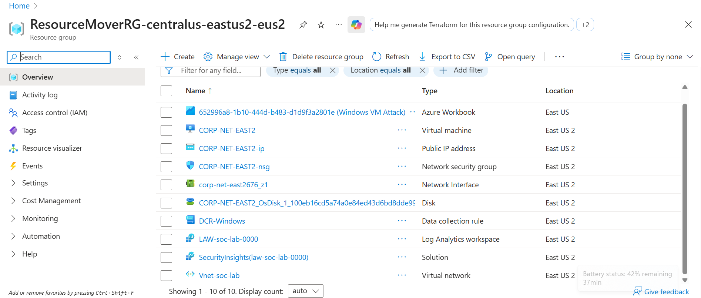
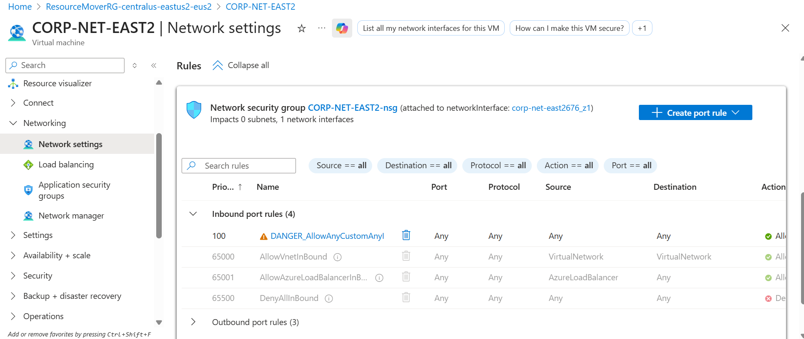
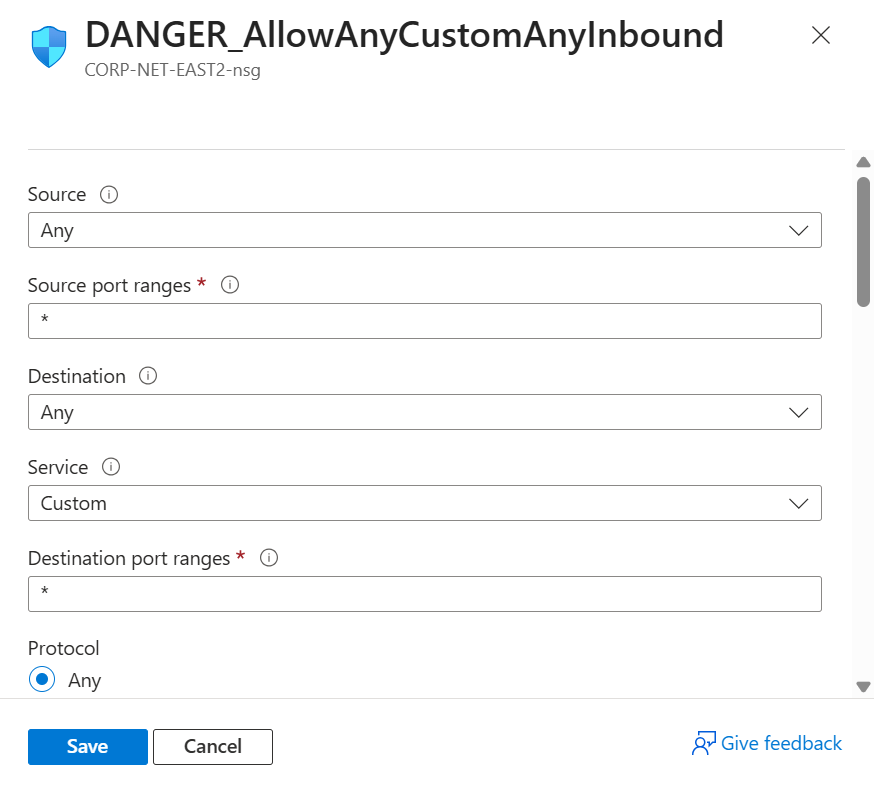
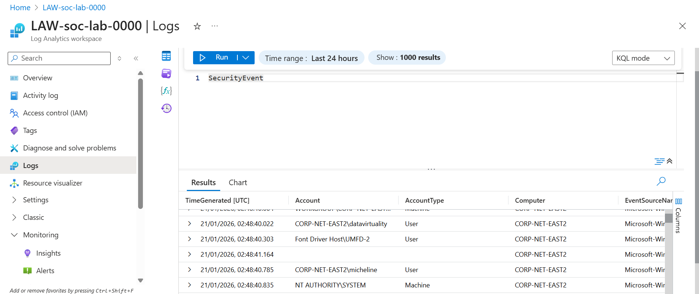
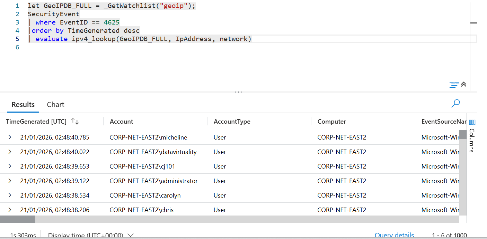
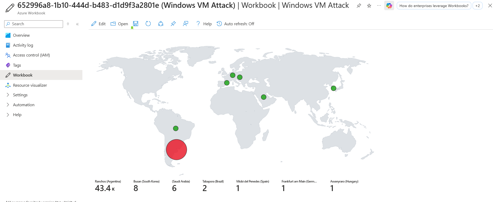
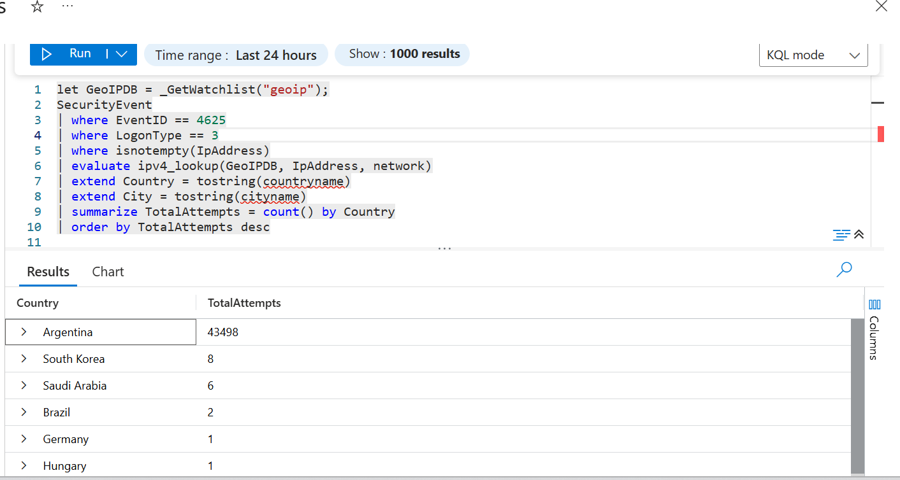

🛡️ Cyber Security Home SOC Lab – Microsoft Sentinel
📌 Project Overview
This project demonstrates how to build a home Security Operations Center (SOC) using Microsoft Azure and Microsoft Sentinel. The lab simulates real-world attacks against a Windows virtual machine, collects security logs, enriches them with GeoIP data, and visualizes attacker activity on a live map.
The goal of this project was to gain hands-on experience with cloud security monitoring, log analysis, and threat detection, similar to a Tier 1 SOC analyst role.

🧰 Tools & Technologies Used
•	Microsoft Azure
•	Microsoft Sentinel
•	Log Analytics Workspace
•	Windows 10 Virtual Machine
•	Azure Network Security Groups (NSGs)
•	PowerShell
•	Kusto Query Language (KQL)
•	GeoIP Watchlist
•	Remote Desktop Protocol (RDP)

🏗️ Architecture Overview
High-level flow:
1.	A Windows VM is deployed in Azure
2.	The VM is intentionally exposed to the internet
3.	Failed login attempts are logged
4.	Logs are sent to Log Analytics
5.	Sentinel analyzes and enriches logs
6.	Attacker locations are visualized on a map

🪜 Step-by-Step Project Breakdown

1️⃣ Azure Resource Setup
•	Created a dedicated Resource Group for the SOC lab
•	Deployed a Log Analytics Workspace
•	Enabled Microsoft Sentinel on the workspace

2️⃣ Windows Virtual Machine Deployment
•	Deployed a Windows 10 VM in Azure
•	Configured public IP access
•	Enabled RDP (port 3389)
•	Set a local administrator account for login

3️⃣ Intentionally Weak Security Configuration
To simulate real-world attacks:
•	Network Security Group (NSG) allowed RDP from any source
•	No IP restrictions were applied
•	This made the VM visible to internet scanners and attackers

4️⃣ Log Collection Configuration
•	Enabled Windows Security Events in Log Analytics
•	Confirmed that failed login attempts (Event ID 4625) were being ingested
•	Verified logs using KQL queries in Sentinel

5️⃣ Simulating Attacks
•	Left the VM exposed for several hours
•	Observed multiple failed RDP login attempts
•	Attacks originated from multiple global IP addresses

6️⃣ GeoIP Watchlist Setup
•	Imported a GeoIP CSV as a Sentinel Watchlist
•	Included country, city, latitude, longitude, and ASN data
•	Used this data to enrich attacker IP addresses

7️⃣ KQL Detection Query
Used KQL to:
•	Filter failed login attempts
•	Extract attacker IP addresses
•	Enrich data using the GeoIP watchlist
Example logic used:
•	Event ID: 4625
•	Logon Type: 3
•	IPv4 lookup for geolocation enrichment

8️⃣ Attack Map Visualization
•	Created a Sentinel workbook
•	Displayed attacker locations using latitude and longitude
•	Visualized real-time attack sources on a world map
•	The attack map below is after I left my VM running for 7 hours. Be careful not to leave it on forever due to costs

9️⃣ Analysis & Findings
•	The VM received continuous brute-force attempts
•	Attacks originated from multiple countries
•	Demonstrated how quickly exposed systems are targeted
•	Showed the importance of:
o	Network hardening
o	Monitoring
o	Centralized logging

📊 Key Skills Demonstrated
•	Cloud security monitoring
•	Log ingestion and analysis
•	KQL querying
•	Threat detection logic
•	GeoIP enrichment
•	SOC-style investigation workflow
•	Azure cost management (deploy → test → delete)

💡 Lessons Learned
•	Exposed RDP services are rapidly attacked
•	Logging and visibility are critical for detection
•	Microsoft Sentinel provides powerful detection capabilities
•	Cloud SOC skills are highly transferable to real-world roles

🚀 Future Improvements
•	Add alert rules for brute-force detection
•	Integrate Microsoft Defender for Endpoint
•	Automate incident response with Logic Apps
•	Harden NSGs and compare before/after attack data

📁 Repository Contents
•	/queries/ – KQL detection queries
•	/screenshots/ – Lab screenshots
•	/notes/ – Analysis and findings
•	README.md – Project documentation

👤 Author
Phelicine Opetu
Aspiring SOC / Cyber Security Analyst
Azure • Sentinel • SIEM • Detection Engineering

